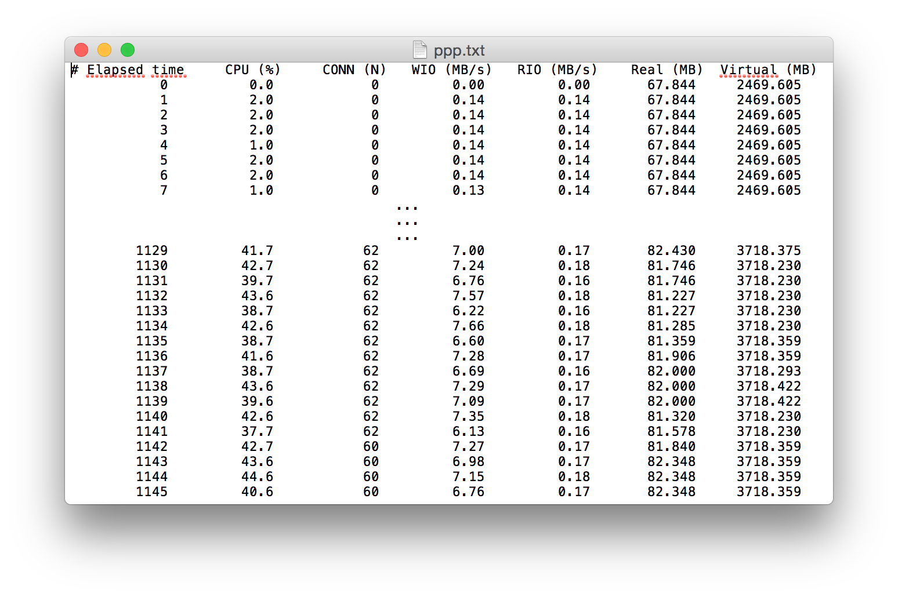

# webrtc-test
Framework for functional and Load Testing of WebRTC

## Install prerequisites
#### CentOS 7
* Install janus: https://github.com/meetecho/janus-gateway
* Install python utilities: `pip install psutil matplotlib`

#### Ubuntu 16.04
* Install chrome: 
```bash
$ wget -q -O - https://dl-ssl.google.com/linux/linux_signing_key.pub | sudo apt-key add -
$ sudo sh -c 'echo "deb [arch=amd64] http://dl.google.com/linux/chrome/deb/ stable main" >> /etc/apt/sources.list.d/google.list'
$ sudo apt-get update
$ sudo apt-get install google-chrome-stable
```
* Download chromedriver from https://sites.google.com/a/chromium.org/chromedriver/downloads
* Install selenium: `pip install selenium`
* Install pytest:  `pip install pytest pytest-xdist pytest-rerunfailures`

## Initiate load tests ##
#### 1. Start monitoring
* on CentOS
```python
# psmon.sh

import sys
import pmm

import matplotlib
matplotlib.use('Agg')

if __name__ == '__main__':
    sys.exit(pmm.main())
```
`$ psmon.sh <PID> --log <FILENAME> --plot <FILENAME> --interval <SECS> --duration <SECS>`
 
#### 2. Run webtest
* on Ubuntu
```python
# webtest.py

from selenium import webdriver

options = webdriver.ChromeOptions()
options.add_argument('headless')
options.add_argument('window-size=1280x720')
options.add_argument("disable-gpu")
options.add_argument('no-sandbox')
options.add_argument("use-fake-device-for-media-stream");
options.add_argument("use-fake-ui-for-media-stream");

driver = webdriver.Chrome(<CHROMEDRIVER_PATH>, chrome_options=options)
driver.get(<URL>)
driver.implicitly_wait(30)
driver.find_element_by_id("start").click()

#driver.quit()
```
`$ py.test -n <numprocesses> webtest.py`

#### 3. End monitoring
* Terminate process with **<CTRL+C>** on CentOS
* Log files generation and test results recording

## Analyze the results ##
a quad core CPU with 8GB RAM, 640x480 1Mbits/s



<hr/>

### GStreamer (with janus streaming plugin)
* Install gstreamer: `$ yum install gstreamer1*`
* Start gstreamer: `$ /opt/janus/share/janus/streams/test_gstreamer_1.sh`
```sh
#!/bin/sh
gst-launch-1.0 \
  audiotestsrc ! \
    audioresample ! audio/x-raw,channels=1,rate=16000 ! \
    opusenc bitrate=20000 ! \
      rtpopuspay ! udpsink host=127.0.0.1 port=5002 \
  videotestsrc ! \
    video/x-raw,width=320,height=240,framerate=15/1 ! \
    videoscale ! videorate ! videoconvert ! timeoverlay ! \
    vp8enc error-resilient=1 ! \
      rtpvp8pay ! udpsink host=127.0.0.1 port=5004
```
* Janus streaming plugin configuration: `$ cat /opt/janus/etc/janus/janus.plugin.streaming.cfg`
```
[gstreamer-sample]
type = rtp
id = 1
description = Opus/VP8 live stream coming from gstreamer
audio = yes
video = yes
audioport = 5002
audiopt = 111
audiortpmap = opus/48000/2
videoport = 5004
videopt = 100
videortpmap = VP8/90000
secret = adminpwd
```
